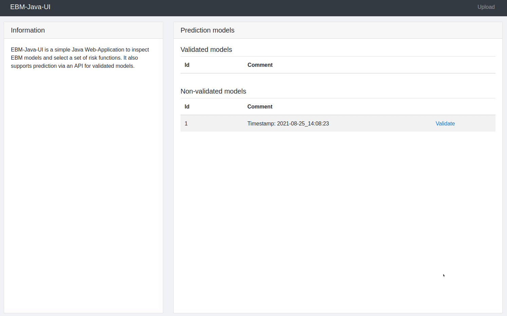

# EBM-Java-UI

A web-based user interface to visualize and inspect [Explainable Boosting Machines (EBM)](https://github.com/interpretml/interpret). It also allows to remove risk functions in a validation step and use the resulting model for predictions: However, the prediction module was not tested sufficiently yet. This software was used in two research projects to present learned risk functions to practitioners and we wanted to make the code accessible to other researchers. 

1. [An Evaluation of the Doctor-Interpretability of Generalized Additive Models with Interactions](http://proceedings.mlr.press/v126/hegselmann20a.html)
2. (Reference follows)



## Run Project

This setup was tested for Ubuntu 20.04. It uses an example project build from `example/EBM-Java-UI.war`.
* Install Java 13: `sudo apt-get install openjdk-13-jdk`.
* Install Tomcat 9: `sudo apt-get install tomcat9 tomcat9-admin tomcat9-user`.
* Install PostgreSQL: `sudo apt-get install postgresql`.
* Configure a user for PostgreSQL called "postgres": Login with `sudo -u postgres psql` and set password
  according to the `datasource.password` field in `src/main/webapp/config/config.properties` with
  `ALTER USER postgres WITH PASSWORD '<db.password>';`. Use password `s27P5hXhHKGoYzIO` to run the example build.
* Create a new database called "ebmjavaui-db": `create database "ebmjavaui-db";`. Verify whether it was created with  `\l` (
  exit with `q`).
* Connect to the ebmjavaui-db database: `\c ebmjavaui-db`. Afterwards run "createDB.sql" with `\i createDB.sql` to
  create the necessary schemes and exit with `\q`.
* Configure your user as tomcat admin: `sudo nano /etc/tomcat9/tomcat-users.xml` and add an entry for a new user, e.g. `<user username="user" password="add-your-pw" roles="admin-gui, manager-gui"/>`
* Start tomcat: `systemctl start tomcat9`. It can be stopped using `systemctl stop tomcat9`.
* To deploy the project visit `http://localhost:8080/manager` and login with the admin user created previously. At "WAR file to deploy" select the example build (`example/EBM-Java-UI.war`) and press deploy.
* Go to http://localhost:8080/EBM-Java-UI to check if it works.

## Run Example

* Install requirements of visualization_database.py: `pip install -r scripts/requirements.txt`.
* Parse a dataset like in the example [Notebook](https://nbviewer.jupyter.org/github/interpretml/interpret/blob/master/benchmarks/EBM%20Classification%20Comparison.ipynb) of [InterpretML](https://github.com/interpretml/interpret).
* Train an EBM with the Data. [Example](https://interpret.ml/docs/getting-started.html#train-a-glassbox-model).
* Call `store_ebm_model()` of visualization_database.py with the EBM Model, a timestamp and the password of the ebmjavaui-db database as parameters.
* The EBM should now be stored in the database and can be inspected and validated using EBM-Java-UI.
* An Example can be seen in `example/example.py`. It can be run after adjusting the password according to the ebmjavaui-db database and installing requirements with `pip install -r example/requirements.txt`.

Example Code:
```
# Load dataset.
dataset = load_heart_data()
X_train, X_test, y_train, y_test = train_test_split(
dataset['full']['X'], dataset['full']['y'], test_size=0.2)

# Train EBM model.
ebm = ExplainableBoostingClassifier(random_state=seed)
ebm.fit(X_train, y_train)

# Load trained EBM model into EBM-Java-UI and inspect it via http://localhost:8080/EBM-Java-UI/.
timestamp = datetime.now().strftime("%Y-%m-%d_%H:%M:%S")
store_ebm_model(ebm, timestamp, "<db-password>")]()
```

## Setup Environment to Compile Project
This setup is valid for the IntelliJ IDE. Please adapt, if necessary. Steps 1-5 from [Run Project](#run-project) are required.
* Install IntelliJ, open it and clone the project: https://github.com/stefanhgm/EBM-Java-UI.git
* Set project SDK to opendjdk-13:`File -> Project Structure -> Project -> Project SDK`(set project SDK to 13)
* Add the PostgreSQL datasource to IntelliJ: `View -> Tool Windows -> Database` and
  add a Data Source PostgreSQL with the according DB login information (you can now run createDB.sql from within
  IntelliJ by right-clicking on it -> "Run")
* Add tomcat to IntelliJ: `File -> Settings -> Build, Execution, Deployment -> Application Server -> Add Tomcat Server` (
  default Home: `/usr/share/tomcat9`, Base: `/var/lib/tomcat9`)
* Add a run configuration to build the project locally and deploy it automatically: `Add Configuration/Edit
  Configuration (upper right corner next to the build button) -> "Plus" -> Tomcat Server -> local`. Choose the previously
  configured tomcat server as application server. In the box "Before launch:..." delete all entries and add a single one
  for `Run Maven Goal` with `clean install` as Command Line. Set URL to "http://localhost:8080/". In the tab Deployment
  add the artifact ebm-java-ui:war and set application context to `/`)
* Add another tomcat configuration "Tomcat install" by repeating the above step and just use the maven goal "install"
  only. This should lead to faster build when clean is not necessary.
* These configurations ought to work, however, certain problems with permission occurred in the described setup. The best
  way to fix them should be to change ownership of all tomcat directories to the group tomcat and add the local user to
  this group. This did not work out and one workaround seems to be setting rights to 777 for tomcat directories in order to
  make them accessible for IntelliJ: `sudo chmod 777 -R /var/lib/tomcat9`, `sudo chmod 777 -R /etc/tomcat9`
* Edit the shutdown port of tomcat: `nano /var/lib/tomcat9/conf/server.xml` and edit the server line for shutdown like this `<Server port="8079" shutdown="SHUTDOWN"\>`
* Please notice that tomcat started from IntelliJ and manually from the  command line via `systemctl start tomcat9` can interfere. Stop one of them to start the other (either by hitting stop in IntelliJ or by `systemctl stop tomcat9`)
* Set custom password in `src/main/webapp/config/config.properties` (and set database password accordingly)